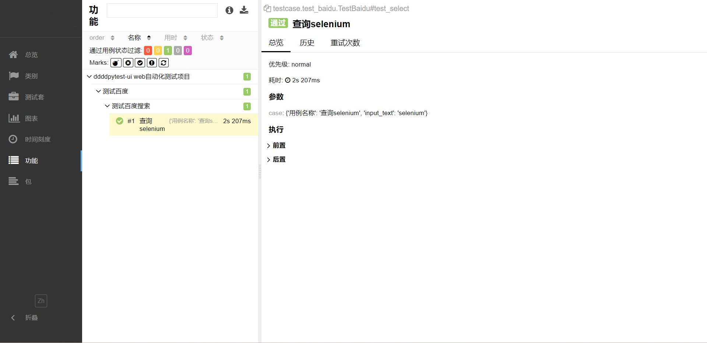

:link:[真希望你没见过什么世面，一生只爱我这张平凡的脸](https://music.163.com/#/song?id=1963720173)
# 带带弟弟pytest-ui

本项目实现UI自动化的技术选型：**Python+Selenium+Pytest+Allure+Excel+Loguru** ，
通过Python+Selenium来操作浏览器， 使用Pytest作为测试执行器，
使用Allure生成测试报告，使用Excel管理测试数据，使用Loguru管理日志。

## 特征

- 采用pom(page object module)设计模式,将元素处理与业务分离
- 项目运行自动生成错误截图、Log日志文件、Allure报告
- 支持多套配置文件之间切换
- 支持mysql数据库连接及操作

:loudspeaker:项目测试环境：win11+python3.10

## Allure报告



## Demo部署

- 下载项目源码后，在根目录下找到**requirements.txt**文件，然后通过 pip 工具安装 requirements.txt 依赖，执行命令：

```shell
pip3 install -r requirements.txt
```
- 下载并配置allure2，下载安装教程如下：https://blog.csdn.net/lixiaomei0623/article/details/120185069

- 之后运行**main.py**，或在Terminal窗口cd到项目根目录后执行命令：

```shell
pytest
```

## 项目结构

```text
├─base              selenium二次封装
├─common            公共方法
├─config            项目配置文件
├─img               图像文件
├─logs              日志文件
├─page              存放页面对象
├─reports           allure测试报告
├─temp              allure临时报告
├─test              项目测试代码
├─testcase          存放测试用例
├─testdata          存放测试数据
├─utils             各种工具类
├─main.py           项目运行入口
├─pytest.ini        pytest配置文件
└─requirements.txt  相关依赖包文件
```

## demo

```python
""" testcase/test_baidu.py """
import pytest
from utils.readExcel import readExcel
from testcase import BASEPATH


@pytest.mark.parametrize("case", readExcel(str(BASEPATH / "baidu.xlsx")))
def test_select(case, page):
    page.baiduSelect(case["scanner"])
```

```python
""" page/baidu.py """
from selenium.webdriver.common.by import By
from base.basepage import BasePage


class BaiduPage(BasePage):
	url = "https://www.baidu.com"
	kw = By.ID, "kw"
	su = By.ID, "su"

	def baiduSelect(self, *args):
		self.write(*args, into=self.kw,name="百度输入框")
		self.click(location=self.su,name="百度一下按钮")
```

## 支持

1. 如果喜欢ddddpytest-ui，可以在GitHub Star。
2. 本项目使用过程中遇到问题或一起交流学习可添加微信或
[telegram](https://t.me/qingtest) 进行沟通。

