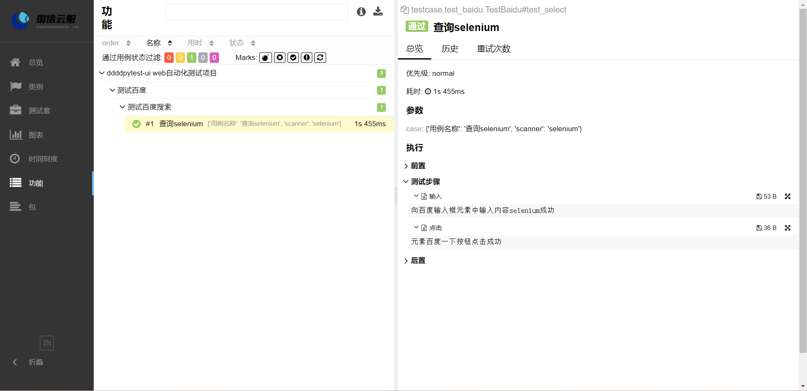

:link:[真希望你没见过什么世面，一生只爱我这张平凡的脸](https://music.163.com/#/song?id=1963720173)
# 带带弟弟pytest-ui

本项目实现UI自动化的技术选型：**Python+Selenium+Pytest+Allure+Excel+Loguru** ，
通过Python+Selenium来操作浏览器， 使用Pytest作为测试执行器，
使用Allure生成测试报告，使用Excel管理测试数据，使用Loguru管理日志。

- 采用pom(page object module)设计模式,将元素处理与业务分离
- 多变量环境，可设置变量，全局变量及环境变量
- 支持多套配置文件之间切换
- 支持mysql数据库连接及操作
- 项目运行自动生成错误截图、Log日志文件、Allure报告

:loudspeaker:项目测试环境：win11+python3.10

## Allure报告



## Demo部署

- 下载项目源码后，在根目录下找到**requirements.txt**文件，然后通过 pip 工具安装 requirements.txt 依赖，执行命令：

```shell
pip3 install -r requirements.txt
```
- 下载并配置allure2，下载安装教程如下：https://blog.csdn.net/lixiaomei0623/article/details/120185069

- 之后运行**main.py**，或在Terminal窗口cd到项目根目录后执行命令：

```shell
pytest
```

## 项目结构

```text
- base >> selenium二次封装
- common >> 各种工具类
- config >> 项目配置文件
- environment >> 环境变量
- err_img >> 错误截图
- img >> 图像文件
- logs >> 日志文件
- page >> 存放页面对象
- reports >> allure测试报告
- temp >> allure临时报告
- test >> 项目测试代码
- testcase >> 存放测试用例
- testdata >> 存放测试数据
- main.py >> 项目运行入口
- pytest.ini >> pytest配置文件
- requirements.txt >> 相关依赖包文件
```

## 联系作者

如果喜欢该项目就:star2:下吧。:heart:本项目使用过程中遇到问题可添加微信或telegram进行沟通。

Telegram: [qingtest](https://t.me/qingtest)

